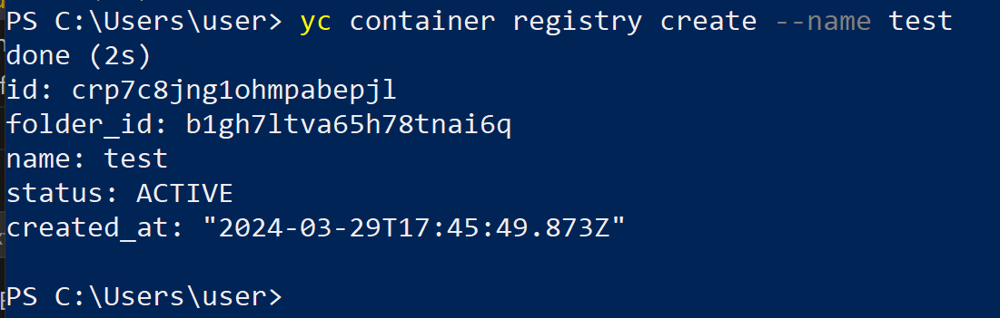

# Домашнее задание к занятию 5. «Практическое применение Docker» - Илларионов Дмитрий

### Инструкция к выполнению

1. Для выполнения заданий обязательно ознакомьтесь с [инструкцией](https://github.com/netology-code/devops-materials/blob/master/cloudwork.MD) по экономии облачных ресурсов. Это нужно, чтобы не расходовать средства, полученные в результате использования промокода.
3. **Своё решение к задачам оформите в вашем GitHub репозитории.**
4. В личном кабинете отправьте на проверку ссылку на .md-файл в вашем репозитории.
5. Сопроводите ответ необходимыми скриншотами.

---
## Примечание: Ознакомьтесь со схемой виртуального стенда [по ссылке](https://github.com/netology-code/shvirtd-example-python/blob/main/schema.pdf)

---

## Задача 1
1. Сделайте в своем github пространстве fork репозитория ```https://github.com/netology-code/shvirtd-example-python/blob/main/README.md```.   
2. Создайте файл с именем ```Dockerfile.python``` для сборки данного проекта(для 3 задания изучите https://docs.docker.com/compose/compose-file/build/ ). Используйте базовый образ ```python:3.9-slim```. Протестируйте корректность сборки. Не забудьте dockerignore. 

* _создал .dockerignore но, пока в него писать нечего, т.к. я не копирую папками ничего в докер образ (копирую только то что явно нужно)._
* _создаю образ докера:_

```
docker build  -f Dockerfile.python -t mydoc .
```


3. (Необязательная часть, *) Изучите инструкцию в проекте и запустите web-приложение без использования docker в venv. (Mysql БД можно запустить в docker run).

_Вот что сделал:_
_Создал файл компоса:_

```
version: '3.7'

# Use root/example as user/password credentials
services:

  mysql:
    image: mysql
    # NOTE: use of "mysql_native_password" is not recommended: https://dev.mysql.com/doc/refman/8.0/en/upgrading-from-previous-series.html#upgrade-caching-sha2-password
    # (this is just an example, not intended to be a production configuration)
    command: --default-authentication-plugin=mysql_native_password
    restart: always
    #env_file: .env
    environment:
      MYSQL_ROOT_PASSWORD: 12345
      MYSQL_USER: user
      MYSQL_PASSWORD: 12345
    ports:
      - 3306:3306
    volumes:
      - ./docker_volumes/mysql:/var/lib/mysql
    networks:
      docker-net:
        ipv4_address: 172.20.0.10

networks:
  docker-net:
    driver: bridge
    ipam:
      config:
      - subnet: 172.20.0.0/24
```

```
apt install mariadb-client-core-10.6
mysql -p -h 172.20.0.10 -P 3306 -u root
```

```
MySQL [(none)]> create database db1;
```


_Запустил - поднял докер контейнер с MYSQL_
_через DBeaver создал db1 и запустил:_

```
export DB_HOST=172.20.0.10 \
export DB_USER=root \
export DB_PASSWORD=12345 \
export DB_NAME=db1

apt install python3.10-venv
python3 -m venv venv
. venv/bin/activate
pip install -r requirements.txt
python main.py
```
_Сделал запрос на внешний адрес и 5000 порт:_


_Но, последующие запросы уже не шли. Вот что было в выводе:_


_И почему-то с пользователем user не заработало, а спользователем root заработало. видимо не хватает прав для user - нужно особо выдавать, не стал, а использовал root_


4. (Необязательная часть, *) По образцу предоставленного python кода внесите в него исправление для управления названием используемой таблицы через ENV переменную.

_правки:_

```
db_table=os.environ.get('DB_TABLE')
...
# SQL-запрос для создания таблицы в БД
create_table_query = f"""
CREATE TABLE IF NOT EXISTS {db_database}.{db_table} (
id INT AUTO_INCREMENT PRIMARY KEY,
request_date DATETIME,
request_ip VARCHAR(255)
)
"""
...

    query = f"""INSERT INTO {db_table} (request_date, request_ip) VALUES (%s, %s)"""

```

и переменные теперь так:

```sh
export DB_HOST=172.20.0.10 \
export DB_USER=root \
export DB_PASSWORD=12345 \
export DB_NAME=db1 \
export DB_TABLE=requests \
```

Остальное без изменений.

Заработало:


интересно что значит конструкция f"""...""" и чем отличатеся от "..." ?

---
### ВНИМАНИЕ!
!!! В процессе последующего выполнения ДЗ НЕ изменяйте содержимое файлов в fork-репозитории! Ваша задача ДОБАВИТЬ 5 файлов: ```Dockerfile.python```, ```compose.yaml```, ```.gitignore```, ```.dockerignore```,```bash-скрипт```. Если вам понадобилось внести иные изменения в проект - вы что-то делаете неверно!
---

## Задача 2 (*)
1. Создайте в yandex cloud container registry с именем "test" с помощью "yc tool" . [Инструкция](https://cloud.yandex.ru/ru/docs/container-registry/quickstart/?from=int-console-help)



2. Настройте аутентификацию вашего локального docker в yandex container registry.


3. Соберите и залейте в него образ с python приложением из задания №1.
4. Просканируйте образ на уязвимости.
5. В качестве ответа приложите отчет сканирования.

### Решение


docker build -t myapp -f Dockerfile.python .


docker compose up -d


docker logs 5f321a9917f9


apt install mysql-client-core-8.0

mysql -p -h 172.20.0.10 -P 3306 -u root --password=12345   --init-command="create database db1;"

mysql> show databases;


docker compose up -d


root@dp:~/shvirtd-example-python# curl -sSL https://storage.yandexcloud.net/yandexcloud-yc/install.sh | bash


yc container registry create --name test


yc container registry configure-docker


docker tag myapp cr.yandex/crp5gbscd8f2re1ga8ip/myapp:latest

docker push cr.yandex/crp5gbscd8f2re1ga8ip/myapp


yc container image list --repository-name=crp5gbscd8f2re1ga8ip/myapp


yc container image scan crprcak0gm7fn41j9ik2

началось сканирование образа:


yc container image list-vulnerabilities --scan-result-id=chekusor1mibehitcpu6


Критическая уязвимость: https://avd.aquasec.com/nvd/2023/cve-2023-45853/


Инструкция:
https://yandex.cloud/ru/docs/container-registry/operations/scanning-docker-image


## Задача 3
1. Изучите файл "proxy.yaml"
2. Создайте в репозитории с проектом файл ```compose.yaml```. С помощью директивы "include" подключите к нему файл "proxy.yaml".
3. Опишите в файле ```compose.yaml``` следующие сервисы: 

- ```web```. Образ приложения должен ИЛИ собираться при запуске compose из файла ```Dockerfile.python``` ИЛИ скачиваться из yandex cloud container registry(из задание №2 со *). Контейнер должен работать в bridge-сети с названием ```backend``` и иметь фиксированный ipv4-адрес ```172.20.0.5```. Сервис должен всегда перезапускаться в случае ошибок.
Передайте необходимые ENV-переменные для подключения к Mysql базе данных по сетевому имени сервиса ```web``` 

- ```db```. image=mysql:8. Контейнер должен работать в bridge-сети с названием ```backend``` и иметь фиксированный ipv4-адрес ```172.20.0.10```. Явно перезапуск сервиса в случае ошибок. Передайте необходимые ENV-переменные для создания: пароля root пользователя, создания базы данных, пользователя и пароля для web-приложения.Обязательно используйте уже существующий .env file для назначения секретных ENV-переменных!

2. Запустите проект локально с помощью docker compose , добейтесь его стабильной работы: команда ```curl -L http://127.0.0.1:8090``` должна возвращать в качестве ответа время и локальный IP-адрес. Если сервисы не стартуют воспользуйтесь командами: ```docker ps -a ``` и ```docker logs <container_name>``` 

5. Подключитесь к БД mysql с помощью команды ```docker exec <имя_контейнера> mysql -uroot -p<пароль root-пользователя>``` . Введите последовательно команды (не забываем в конце символ ; ): ```show databases; use <имя вашей базы данных(по-умолчанию example)>; show tables; SELECT * from requests LIMIT 10;```.

6. Остановите проект. В качестве ответа приложите скриншот sql-запроса.

## Задача 4
1. Запустите в Yandex Cloud ВМ (вам хватит 2 Гб Ram).
2. Подключитесь к Вм по ssh и установите docker.
3. Напишите bash-скрипт, который скачает ваш fork-репозиторий в каталог /opt и запустит проект целиком.
4. Зайдите на сайт проверки http подключений, например(или аналогичный): ```https://check-host.net/check-http``` и запустите проверку вашего сервиса ```http://<внешний_IP-адрес_вашей_ВМ>:8090```. Таким образом трафик будет направлен в ingress-proxy.
5. (Необязательная часть) Дополнительно настройте remote ssh context к вашему серверу. Отобразите список контекстов и результат удаленного выполнения ```docker ps -a```
6. В качестве ответа повторите  sql-запрос и приложите скриншот с данного сервера, bash-скрипт и ссылку на fork-репозиторий.

## Задача 5 (*)
1. Напишите и задеплойте на вашу облачную ВМ bash скрипт, который произведет резервное копирование БД mysql в директорию "/opt/backup" с помощью запуска в сети "backend" контейнера из образа ```schnitzler/mysqldump``` при помощи ```docker run ...``` команды. Подсказка: "документация образа."
2. Протестируйте ручной запуск
3. Настройте выполнение скрипта раз в 1 минуту через cron, crontab или systemctl timer. Придумайте способ не светить логин/пароль в git!!
4. Предоставьте скрипт, cron-task и скриншот с несколькими резервными копиями в "/opt/backup"

## Задача 6
Скачайте docker образ ```hashicorp/terraform:latest``` и скопируйте бинарный файл ```/bin/terraform``` на свою локальную машину, используя dive и docker save.
Предоставьте скриншоты  действий .

## Задача 6.1
Добейтесь аналогичного результата, используя docker cp.  
Предоставьте скриншоты  действий .

## Задача 6.2 (**)
Предложите способ извлечь файл из контейнера, используя только команду docker build и любой Dockerfile.  
Предоставьте скриншоты  действий .

## Задача 7 (***)
Запустите ваше python-приложение с помощью runC, не используя docker или containerd.  
Предоставьте скриншоты  действий .
